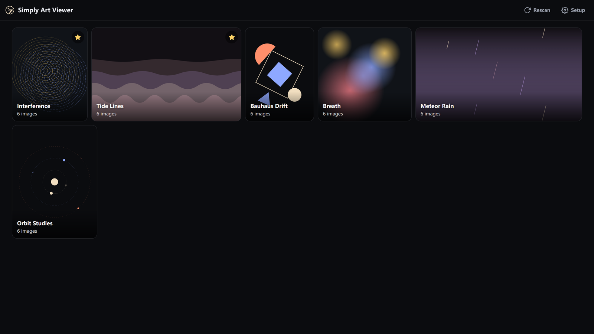
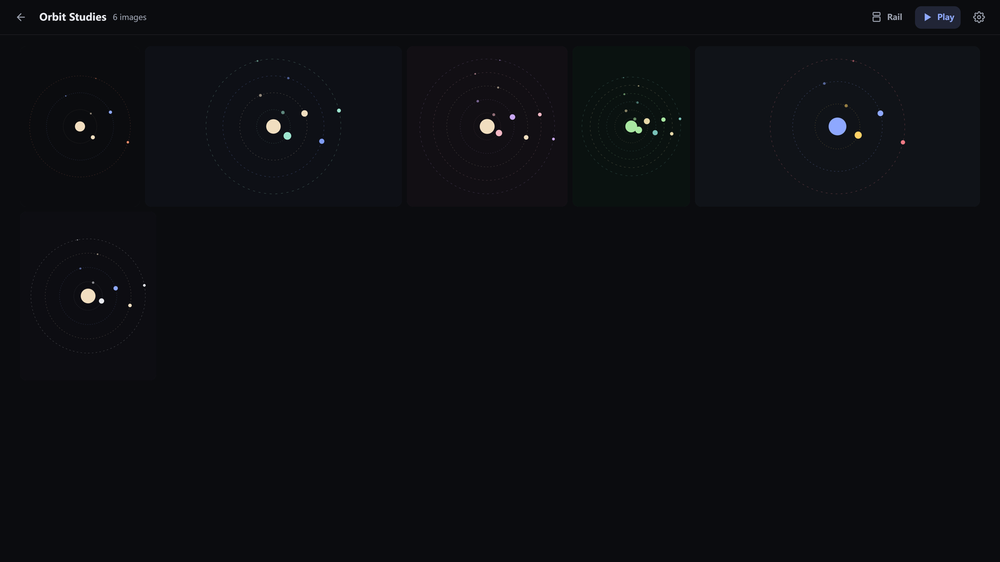
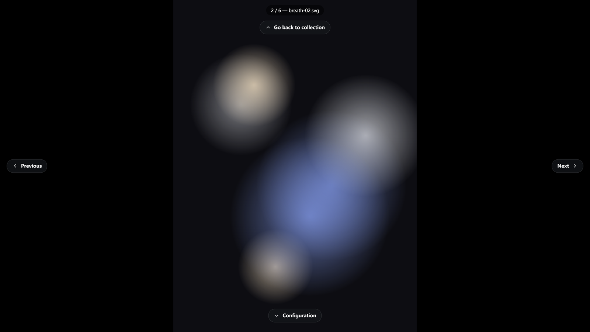
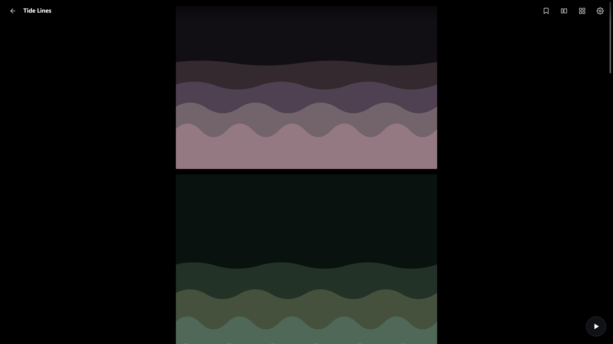
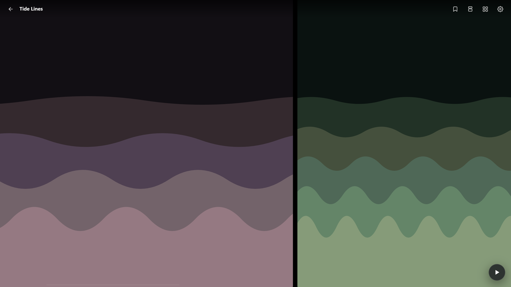
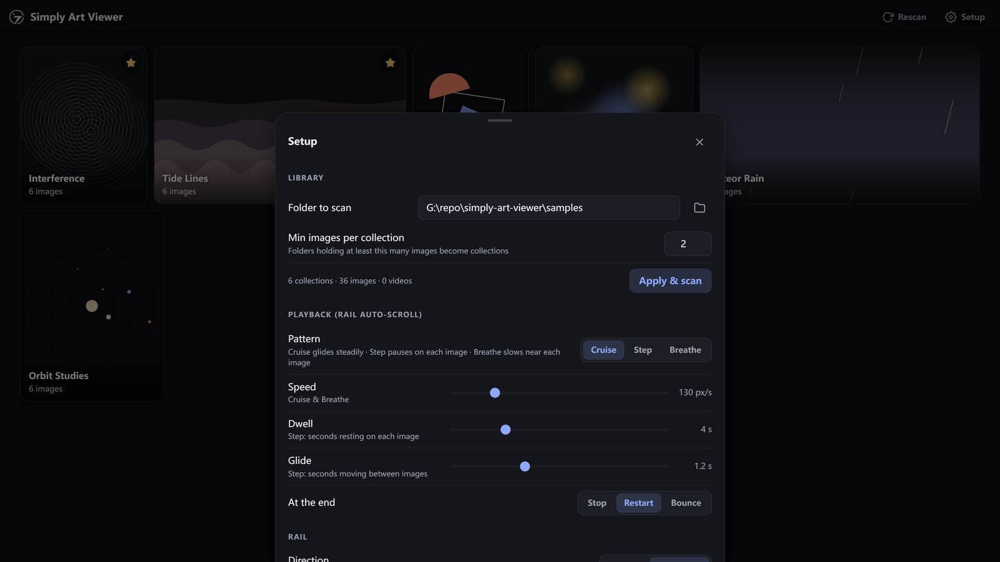

<p align="center">
  
</p>

<h1 align="center">Simply Art Viewer</h1>

<p align="center">
  A fluid, minimal gallery for the art on your disk. Point it at a folder —
  every subfolder holding a few images becomes a collection. Browse in a
  justified mosaic, a full-screen click-zone viewer, or the <b>rail</b>: the
  whole collection on one continuous canvas with buttery smooth scrolling.
</p>



*The screenshots on this page use the bundled [sample library](#sample-library) — 36 CSS-animated abstract SVGs that ship with the repo, so you can try everything before pointing it at your own art.*

## Quick start

```
npm install          # optional but recommended: installs sharp for fast thumbnails
npm start            # → http://127.0.0.1:4877
node server.js samples   # or take the tour with the bundled sample art
```

Prefer a desktop app? **[Download the Windows installer from the Releases
page](https://github.com/TimothyZhang7/simply-art-viewer/releases/latest)** —
or `npm run app` for a dev window.

Everything is configured in the app under **Setup** (gear icon), including a
built-in server-side folder browser — no paths to type unless you want to.

## Home — collections as a mosaic

Collections tile in a justified mosaic that honors each cover's real aspect
ratio (nothing is cropped into uniform squares). The ★ on a tile marks a
favourite; favourites glide to the front and stay anchored there.

## Collection — justified grid

Every layout is computed from scan-time image dimensions, so rows never
reflow while thumbnails stream in.



## Viewer — click zones, no chrome

Click any image to enter the full-screen viewer. The screen itself is the
interface — a one-time guide shows the four zones:



- click **left / right** edges → previous / next
- click **top** → back to the collection · click **bottom** → configuration
- arrows / `Esc`, swipe on touch, `f` fullscreen, `r` rail, `Space` rail + play
- the visible image is progressively upgraded to the **original file** once
  it has decoded — what you see is pixel-identical to what's on disk

## Rail — one continuous canvas

The signature mode: the entire collection on a single scrolling surface,
driven by one GPU transform per frame with inertial wheel, drag-and-throw,
and keyboard motion. Runs vertically or **horizontally** (side by side —
made for portrait sets); flip direction from the top bar or Setup.

<p align="center">
  
  
</p>

- wheel, trackpad, arrows / PageUp / PageDown / Home / End, or grab and throw
- image size auto-fits the collection's dominant shape; Manual mode in Setup
  for an exact size
- `←`/`→` snap between images, `Enter` opens the viewer, `Esc` back
- `b` bookmarks your spot (one per collection, survives restarts); the filled
  bookmark button glides back to it
- **Play** (`Space`) auto-scrolls with a pattern:
  **Cruise** — constant glide · **Step** — eases image-to-image, dwelling on
  each · **Breathe** — slows near each image, accelerates between; at the
  end: stop, restart, or bounce

## Setup

Library path (with folder browser), collection threshold, playback pattern
and speeds, rail direction and sizing, interface preferences — all applied
live.



## Desktop app

**[⬇ Grab the Windows installer from the Releases page](https://github.com/TimothyZhang7/simply-art-viewer/releases/latest)** —
no Node or build step required.

It wraps the same server in a frameless Electron shell: the app's own header
is the title bar (native min/max/close render themed over it), F11
fullscreen, remembered window bounds, and config + caches in
`%APPDATA%\Simply Art Viewer`. It binds an ephemeral localhost port, so it
never collides with a running `npm start`. To build it yourself:
`npm run dist` (installer lands in `dist/`).

## Sample library

`samples/` holds six collections of animated abstract art (36 SVGs — orbits,
tides, breathing gradients, bauhaus shapes, meteor rain, moiré interference).
SVGs are served as originals, so they animate live in every view — try
**Play** on Tide Lines. Regenerate or extend them via
`node tools/make-samples.mjs`.

## Design notes

- Zero-framework backend (Node built-ins only); `sharp` is an *optional*
  dependency — without it the server streams originals instead of webp thumbs.
- Image dimensions are probed from file headers (pure JS) at scan time and
  cached, so every layout is computed before a single pixel loads.
- Thumbnails keep their ICC profiles — wide-gamut photos stay wide-gamut.
- The frontend is vanilla ES modules, no build step. The rail virtualizes the
  DOM (only visible items mounted) and renders through a single GPU transform
  per frame.
- Serving to other devices: `node server.js "D:\Pictures" --host 0.0.0.0`
  (be aware that exposes your library to your network).
